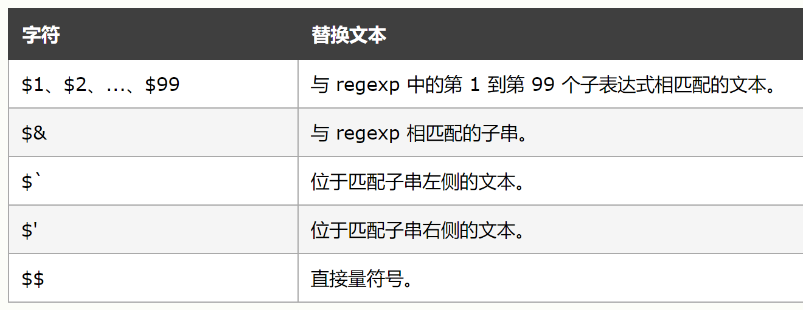

- [1. 执行环境(execution context)](#1-执行环境execution-context)
    - [1.1 执行环境理解](#11-执行环境理解)
    - [1.2 执行环境栈](#12-执行环境栈)
    - [1.3 执行环境细节](#13-执行环境细节)
    - [1.4 变量对象(variable object)](#14-变量对象variable-object)
    - [1.5. 作用域链](#15-作用域链)
- [2. 闭包](#2-闭包)
- [3. 创建对象](#3-创建对象)
- [4. 继承](#4-继承)
    - [4.1 原型链](#41-原型链)
    - [4.2 借用构造函数](#42-借用构造函数)
    - [4.3 组合继承](#43-组合继承)
    - [4.4 原型式继承](#44-原型式继承)
    - [4.5 寄生式继承](#45-寄生式继承)
    - [4.6 寄生组合式继承](#46-寄生组合式继承)
- [5. 垃圾收集](#5-垃圾收集)
- [6. this](#6-this)
- [7. 箭头函数](#7-箭头函数)
- [8. new、call、apply 和 bind](#8-newcallapply-和-bind)
- [9. 理解参数](#9-理解参数)
- [10.深拷贝](#10深拷贝)
- [11. var、let、const](#11-varletconst)
- [12. 数据类型](#12-数据类型)
- [13. 跨域](#13-跨域)
- [14. 节流、防抖](#14-节流防抖)
- [15. JS 设计模式](#15-js-设计模式)
- [16. 高级函数](#16-高级函数)
  - [16.1 作用域安全的构造函数](#161-作用域安全的构造函数)
  - [16.2 惰性载入函数](#162-惰性载入函数)
  - [16.3 函数绑定](#163-函数绑定)
  - [16.4 函数柯里化](#164-函数柯里化)
- [17.遍历](#17遍历)
- [18. 事件处理程序](#18-事件处理程序)
- [19. Class](#19-class)
- [20. Class 继承](#20-class-继承)
- [21. 正则](#21-正则)
  - [21.1 正则匹配字符](#211-正则匹配字符)
  - [21.2 正则匹配位置](#212-正则匹配位置)
  - [21.3 括号的使用](#213-括号的使用)
- [22. 正则的使用](#22-正则的使用)
  - [22.1 RegExp 构造函数](#221-regexp-构造函数)
  - [22.2 RegExp 对象的属性与方法](#222-regexp-对象的属性与方法)
  - [22.3 字符串的正则方法](#223-字符串的正则方法)
- [24. redux 实现](#24-redux-实现)
- [25. 登录状态管理](#25-登录状态管理)
  - [25.1 Token 管理](#251-token-管理)
  - [25.2 token 和 cookie](#252-token-和-cookie)
- [26. cdn（Content Delivery Network 即 内容分发网络）](#26-cdncontent-delivery-network-即-内容分发网络)
- [27. babel](#27-babel)
- [28. BOM](#28-bom)
  - [28.1 window 对象](#281-window-对象)
  - [28.2 location 对象](#282-location-对象)
- [29 setTimeout 和 setInterval](#29-settimeout-和-setinterval)
### 1. 执行环境(execution context)
##### 1.1 执行环境理解
执行环境是 ECMA-262 中用以区分不同的可执行代码的抽象概念。可执行代码可以分为:
1. 全局代码：程序载入后的默认环境
2. 函数代码
3. Eval 代码- [1. 执行环境(execution context)](#1-执行环境execution-context)
    - [1.1 执行环境理解](#11-执行环境理解)
    - [1.2 执行环境栈](#12-执行环境栈)
    - [1.3 执行环境细节](#13-执行环境细节)
    - [1.4 变量对象(variable object)](#14-变量对象variable-object)
    - [1.5. 作用域链](#15-作用域链)
- [2. 闭包](#2-闭包)
- [3. 创建对象](#3-创建对象)
- [4. 继承](#4-继承)
    - [4.1 原型链](#41-原型链)
    - [4.2 借用构造函数](#42-借用构造函数)
    - [4.3 组合继承](#43-组合继承)
    - [4.4 原型式继承](#44-原型式继承)
    - [4.5 寄生式继承](#45-寄生式继承)
    - [4.6 寄生组合式继承](#46-寄生组合式继承)
- [5. 垃圾收集](#5-垃圾收集)
- [6. this](#6-this)
- [7. 箭头函数](#7-箭头函数)
- [8. new、call、apply 和 bind](#8-newcallapply-和-bind)
- [9. 理解参数](#9-理解参数)
- [10.深拷贝](#10深拷贝)
- [11. var、let、const](#11-varletconst)
- [12. 数据类型](#12-数据类型)
- [13. 跨域](#13-跨域)
- [14. 节流、防抖](#14-节流防抖)
- [15. JS 设计模式](#15-js-设计模式)
- [16. 高级函数](#16-高级函数)
  - [16.1 作用域安全的构造函数](#161-作用域安全的构造函数)
  - [16.2 惰性载入函数](#162-惰性载入函数)
  - [16.3 函数绑定](#163-函数绑定)
  - [16.4 函数柯里化](#164-函数柯里化)
- [17.遍历](#17遍历)
- [18. 事件处理程序](#18-事件处理程序)
- [19. Class](#19-class)
- [20. Class 继承](#20-class-继承)
- [21. 正则](#21-正则)
  - [21.1 正则匹配字符](#211-正则匹配字符)
  - [21.2 正则匹配位置](#212-正则匹配位置)
  - [21.3 括号的使用](#213-括号的使用)
- [22. 正则的使用](#22-正则的使用)
  - [22.1 RegExp 构造函数](#221-regexp-构造函数)
  - [22.2 RegExp 对象的属性与方法](#222-regexp-对象的属性与方法)
  - [22.3 字符串的正则方法](#223-字符串的正则方法)
- [24. redux 实现](#24-redux-实现)
- [25. 登录状态管理](#25-登录状态管理)
  - [25.1 Token 管理](#251-token-管理)
  - [25.2 token 和 cookie](#252-token-和-cookie)
- [26. cdn（Content Delivery Network 即 内容分发网络）](#26-cdncontent-delivery-network-即-内容分发网络)
- [27. babel](#27-babel)
- [28. BOM](#28-bom)
  - [28.1 window 对象](#281-window-对象)
  - [28.2 location 对象](#282-location-对象)
- [29 setTimeout 和 setInterval](#29-settimeout-和-setinterval)

当程序的执行流进入到一个可执行的代码时，就进入了一个执行环境中。

##### 1.2 执行环境栈
当执行流进入函数时，函数的`执行环境`会被推入一个`环境栈`中，执行完毕之后弹出，将控制权返回给之前的`执行环境`，栈的底部永远是全局执行环境。这样实现的原因是 JS 的解释器是单线程的，即同一时刻只处理一件事情，其他等待执行的上下文或事件就会在环境栈中排队等待。

##### 1.3 执行环境细节
可以将执行环境抽象为一个对象：
```javascript
ExecutionContextObj = {
  scopeChain,   //指向作用域链头结点的指针
  variableObject, //变量对象
  this:{},
}
```
每当一个函数被调用的时候，就会随之创建一个执行环境，在 JS 解释器内部处理执行环境有两个步骤：
1. 调用阶段(函数被调用之后，函数体执行之前)
   - 扫描执行上下文中的形参、函数以及变量，并依次填充变量(活动)对象的属性

      形参 —— 形参：实参 || undefined

      函数 —— 函数名：函数体 (若变量对象中已经存在同名属性，则覆盖)

      变量 —— 变量名：undefined (若变量对象中已经存在同名属性，不会影响到同名属性)
   - 求出 this 的值
   - 创建作用域链
2. 代码执行阶段
   - 给第一步中初始值为 undefined 的变量赋上相应的值(同名属性覆盖, 可以将函数覆盖掉，即使函数的定义是在变量赋值的下方)
   所以这里也是要执行到才行，不然值依然是 undefined
   ```js
   function fun() {
    function a() {
      console.log('b=', b)
    }
      a()  //b= undefined
      var b = 4
    }
   fun()

   function fun() {
    a() //3 in functoin
    var a = 3
    function a() {
        console.log('3 in function')
    }
    console.log(a) //3
   }
   fun()
   ```

还可以认为有一个阶段，调用函数前，创建函数时，会创建一个预先包含外部和全局变量(活动)对象的作用域链，保存在内部的 `[[Scope]]` 属性中。在调用时再复制其中的对象构建执行环境的作用域链，此后，又一个活动对象被创建并被推入作用域链的前端。因此，调用的时候才创建作用域链，但是作用域链的内容和创建是的位置有关。(这应当也是闭包的原理)

从这里也可以清楚的知道 JS 中的变量、函数**声明提升**的原理。

##### 1.4 变量对象(variable object)
每一个执行环境都有一个与之关联的变量对象(保存了上下文中声明的变量、函数)。

变量对象是规范上的，不可在 JS 环境中访问，是执行环境中定义的(可以认为是 `[[Scope]]` 中的作用域链类似吧？)，而只有进入到一个环境中，对应的变量对象才会被激活成为活动对象(activation object)(使用 `arguments` 初始化)。活动对象上的各种属性才能被访问。当在函数内调用其他函数时，当前函数的变量对象依然在激活状态，所以可以通过作用域链访问到其中的变量和函数。

变量对象值包含定义的变量和函数，活动对象还另外包含了 `arguments` 和 函数形参。

全局对象中的变量对象就是全局对象本身，因此才可以通过全局对象的属性来访问在全局上下文中声明的变量。

##### 1.5. 作用域链
作用域链本质是指向`活动对象`的指针列表。

当代码在一个环境中执行时，会创建`活动对象`的一个`作用域链`，作用域链的作用，是保证对执行环境的有序访问。若该环境是函数，则将其活动对象做为变量对象。作用域链前端的变量对象，来自当前执行环境，下一个变量对象，则来自下一个执行环境。这样，一直延续到全局执行环境。

标识符解析是沿着作用域链一级一级的搜索标识符直到找到为止的过程。也因为作用域链包含的是活动对象，所以活动对象内部属性值有可能变化，通过作用域链查找到的值也会随着变化。

参考：
- 《JavaScript 高级程序设计 第三版》
- https://www.jianshu.com/p/76ed896bbf91
- https://blog.csdn.net/thumd_lee/article/details/53523744
- [js 中的活动对象与变量对象什么区别？](https://www.zhihu.com/question/36393048/answer/71879330)

### 2. 闭包

闭包指有权访问另一个函数作用域中的变量的函数，创建闭包的常见方式，就是在一个函数内部创建另一个函数。
1. 若是内部函数被返回，且在其他地方被调用，它仍然可以访问外部函数中的变量。因为内部函数的作用域链中包含了外部函数的作用域。
2. 一般情况下，函数执行完毕,局部活动对象就被销毁，但因为内部函数的引用，外部函数的活动对象依然会留在内存中，虽然其执行环境的作用域链被销毁;直到内部(匿名)函数被销毁后(解除对其引用，设为 `null`)，外部函数的活动对象才会被销毁。
3. 副作用：闭包是通过作用域链的变量(活动)对象对变量进行访问，而不是单独保存了某些特殊变量,所以闭包只能取到变量的最新的值。在某些情况下，可以创建一个匿名立即执行函数强制让闭包的行为符合预期。
4. 匿名函数的执行环境具有全局性，所以其 `this` 通常指向 `window。`
5. 内部函数无法直接访问到外部函数的 `this` 和 `arguments`（箭头函数可以）。把外部作用域中的 `this` 保存在一个闭包能够访问到的变量中(赋值给一个变量，该变量会保存在活动对象中)，可以解决这个问题。
6. 结合闭包和匿名函数，可以模仿块级作用域：
   ```js
   function outputNumbers(count) {
     //匿名函数中定义的任何变量，都会在执行结束时被销毁。这种做法可以减少闭包占用的内存问题，因为没有指向匿名函数的引用，只要函数执行完毕，就可以立即销毁其作用域链了。
     (function() {
       //该匿名函数是一个闭包，可以访问包含作用域中的所有变量，包括count
       for(var i = 0; i < count; i++) {
         console.log(i);
       }
     })();

     console.log(i);
   }
   ```

闭包可能会占用更多的内存,要仍然确保作用域链的存在。

### 3. 创建对象

使用Object构造函数和对象字面量可以用来创建单个对象，但创建多个对象可能会产生大量重复代码。

1. 工厂模式 将创建具体对象(使用Object构造函数和对象字面量)的过程抽象为函数。解决了创建多个相似对象的问题，却没有解决对象识别的问题(知道对象的类型)。
2. 构造函数模式 创建自定义构造函数，与工厂模式的区别在于：
   - 没有显示地创建对象;
   - 直接将属性和方法赋给 `this` 对象;
   - 没有 `return` 语句;
   - 函数名一般会大写首字母(构造函数与其他函数的唯一区别是调用方式，通过 new 操作符来调用，就可以作为构造函数);
   - 要创建实例，必须使用 new 操作符;

    使用构造函数实际上会经历4步：
    1. 创建一个对象;
    2. 对象被执行 [[prototype]] 连接; 将构造函数的作用域赋给新对象(`this` 指向该新对象);
    3. 执行构造函数中的代码(为对象添加属性);
    4. 如果函数没有返回其他对象(包含 Function, Array, Date, RegExg, Error)，返回的基本类型(Null, Undefined, Number, String, Boolean, Symbol)或没有 return 语句则返回新对象;

    使用构造函数创建的实例都有一个 `constructor` 属性（其实是实例的原型对象中的属性）指向构造函数;还可以通过 `instanceof` 验证构造函数和实例的关系。

    使用构造函数模式的优点在于可以将它的实例标识为一种特定的类型，它的主要问题是:每个方法都要在每个实例上重新创建一遍，因为在ECMAScript 中，函数也是对象。可以通过把函数定义转移到外部来解决，但若有多个这样的函数，那构造函数就没有什么封装性可言了。
3. 原型模式
   每个函数都有一个 `prototype` 属性，该属性指向一个对象。字面上来讲，`prototype` 指向通过调用构造函数创建的对象实例的原型对象，而所有的对象实例共享原型对象的属性和方法。

   原型对象特点：
   1. 默认情况下，所有原型对象都自动获得一个 `constructor` 属性，指向 `prototype` 所在函数。`constructor` 之外的其他方法，都是从 `Object` 继承而来。
   2. 调用构造函数创建的实例，内部包含一个指针[[prototype]] (内部指针)指向原型对象，脚本中无标准的访问方式，chrome、firefox 和 safari 都支持一个属性 `_proto_` 访问。重要的是，这个连接存在于实例和原型对象之间。
   3. 动态性：实例与原型之间的连接是一个指针，而不是副本，所以对原型对象的修改能立即在实例上反应出来。但重写整个原型对象相当于把构造函数的 `prototype` 指向了另外的原型对象，再修改对之前的实例和最初原型都没有影响了。
   4. 虽然内部指针无法在所有的实现中访问到，但可以通过 `isPrototypeof()` 来确定对象之间是否存在这样的关系。通过 `Object.getPrototypeOf()` 可以方便取得一个对象的原型。
   5. 当代码读取对象的某个属性的时候，会先搜索对象实例本身，若未找到，则继续搜索内部指针指向的原型对象。这正是多个对象实例共享原型对象保存的属性和方法的基本原理。因此，给对象实例添加同名属性可以屏蔽原型中的属性;也可以使用 `delete` 操作符删除实例属性，重新访问到原型中的属性。
   6. 对实例和原型的属性检测有多种方法：
      - `hasOwnProperty()` 可以检测一个属性是否存在于对象实例中。
      - `in` 操作符有单独使用和在 `for-in` 循环中使用两种方式：  
        单独使用时，只要通过对象能够访问的属性都能返回 `ture` ，结合 `hasOwnProperty` 便可以确定属性是否存在，以及存在于实例中还是存在于原型中;  
        `for-in` 循环返回的是所有通过对象能访问的、可枚举的属性,屏蔽了原型中不可枚举属性(`[[Enumerable]]`标记为 `false` 的属性)的实例属性也会在其中，因为所有开发人员定义的属性都是可枚举的。
      - `Object.getOwnPropertyNames()` 可以得到所有的实例属性，而 `Object.keys()` 可以取得对象上所有可枚举的实例属性。

    使用原型模式更简单常见的做法是用一个包含所有属性和方法的对象字面量来重写整个原型对象，结果的区别在于 `constructor` 属性不再指向原构造函数，而是指向 `Object` 构造函数，`instanceof` 操作符能返回正确的结果。若 `constructor` 值很重要，则可以在对象字面量中显示指定 `constructor` 属性的值，这样的问题是 `constructor` 的 `[[Enumerable]]` 特性被设置为 `true`;使用 `Object.defindProperty()` 定义可以避免这个问题。

    所有原生的引用类型( `Object`, `Array`, `String` 等)都是采用原型模式创建的，因此通过原生对象的原型，可以取得所有默认方法的引用，也可以定义新方法(不推荐)。

    原型模式的问题在于：不能为构造函数传递初始化参数，会带来一些不便;更重要的是，原型中存在引用类型时，可能出现意料外的多个实例共享引用类型的情况(基本类型修改时一般会用到 "=",属于对属性的动态添加，会覆盖原型属性;而引用类型则可能使用比如 `push` 直接操作了原型数据)。

4. 组合使用构造函数模式和原型模式

   创建自定义类型最常见的方式，就是组合使用二者，构造函数模式用于定义实例属性，而原型模式用于定义方法和共享属性。

5. 动态原型模式

   组合模式构造函数和原型是独立的，可能会让人困惑。动态原型把所有的信息封装在构造函数中，通过在构造函数中初始化原型，同时兼顾了二者的优点。

   构造函数会多次调用，而原型的初始化一次就够了，可以通过检查某个应该存在的方法是否有效，来决定是否初始化原型：
   ```javascript
   function Person() {
     ...
     //不必检查每个属性和方法，只需要检查其中一个即可
     if(typeof this.sayHello != "function") {
       Person.prototype.sayHello = function() {};
     }
   }
   ```
   使用动态原型模式时，不能使用对象字面量重写原型，因为这会切断现有实例（第一个实例，之后原型创建好了就不会有这样的问题）与新原型的联系。
6. 寄生构造函数模式

   该模式除了使用 `new` 操作符以及一般会大写构造函数首字母外，与工厂模式没有什么区别。它主要是在一些特殊情况下用来为对象创建构造函数;比如基于一些原生的引用类型,加上一些新的属性、方法定义新的类型。

   该模式仅仅是在构造函数中创建并返回对象，所以该构造函数产生的对象与构造函数的原型对象之间没有关系，也不能依赖 `instanceof` 来确定类型。

7. 稳妥构造函数模式

   **稳妥对象**指没有公共属性，其方法也不引用 `this` 的对象，该对象最适合在一些安全的环境(禁止使用 `this` 和 `new` )中使用,或防止数据被其他应用程序改动。该模式与寄生构造函数模式的区别在于不使用 `new` 操作符调用构造函数，新创建对象的实例方法也不引用 `this`。

   在该构造函数中定义的私有变量，通过创建的对象的方法进行访问(类似闭包)，而即使有代码再给对象实例添加方法或数据成员，也没有其他属性和方法可以访问到这些参数，这种安全性使得它非常适合在某些安全执行环境下使用。

### 4. 继承
许多OO语言都支持两种继承方式：
1. 接口继承 只继承方法签名
2. 实现继承 继承实际的方法

ECMPScript 只支持实现继承，且实现主要依靠原型链来实现。

##### 4.1 原型链
使用原型链实现继承，基本思想是利用原型让一个引用类型继承另一个引用类型的属性和方法，即原型对象等于另一个类型的实例(这里注意 constructor 一般会随着原型的改变而改变)。利用原型链实现继承，属性的查找就会沿着原型链层层向上，原型链的最后指向 `Object.prototype` (Object 也只是一个构造函数)。原型链的终点是null。

特点：
1. instanceof 操作符号可以测试实例与原型链中的所有构造函数; isPrototypeOf() 方法也可以用于原型链中的所有原型。
2. 原型链最主要的问题在于包含引用类型值的原型属性会被所有实例共享，这和创建对象原型模式的主要问题相似; 另一个问题是，在创建子类型实例时，无法在不影响所有对象实例的情况下，给超类构造函数传递参数。

##### 4.2 借用构造函数
借用构造函数(也叫伪造对象或经典继承)，它的思想是在子类型构造函数的内部调用超类构造函数。函数只是在特定环境中执行的代码的对象，因此通过 apply() 和 call() 可以在(将来)新创建的对象上执行构造函数。
```JS
function SuperType(name) {
  this.name = name;
  this.colors = ["red", "blue", "green"];
}

function SubType(name, age) {
  SuperType.call(this, name);
  this.age = age;
}
```
这种方式解决了原型链引用类型值共享以及给超类构造函数传参的问题，但无法避免构造函数模式存在的问题 —— 方法都在构造函数中定义，函数无法复用;且在超类型原型中定义的方法和属性，对子类也是不可见的。

##### 4.3 组合继承
组合继承(也叫为伪经典继承)是JS中最常使用的继承模式，思路是使用原型链实现对原型属性和方法的继承，而通过构造函数实现对实例属性的继承。
```JS
function SuperType(name) {
  this.name = name;
  this.colors = ["red", "blue", "green"];
}

SuperType.prototype.sayName = function () {};

function SubType() {
  SuperType.call(this, 'lili');
  this.age = age;
}
SubType.prototype = new SuperType();
//SubType.prototype.constructor = SubType;
```
##### 4.4 原型式继承
原型式继承并没有严格意义上的构造函数，其想法是借助原型可以基于已有的对象创建新对象，同时还不必因此创建自定义类型。
```JS
function object(o) {
  function F() {}
  F.prototype = o;
  return new F();
}
```
这种对象要求有一个对象作为另一个对象的基础。ECMAScript5 新增 `Object.create(object, options)` 方法规范化了原型式继承，其中参数 options 可选，它与 Object.defineProperties() 的第二个参数格式相同，它指定的属性会覆盖原型对象上的同名属性。

##### 4.5 寄生式继承
寄生式继承的思路与寄生构造函数和工厂模式类似，即创建一个仅用于封装继承过程的函数。该函数在内部以某种方式来增强对象，最后再像真是它做了所有的工作一样返回对象。
```JS
function createAnother(original) {
  var clone = Object.create(original);
  clone.sayHello = function() {};
  return clone;
}
```
在主要考虑对象而不是自定义类型和构造函数的情况下，寄生式继承也是一种有用的模式；`Object.create()` 不是必须的，任何能返回新对象的函数都适用于此模式。该模式为对象添加的函数也不能做到函数复用。

##### 4.6 寄生组合式继承

JS中最常用组合继承最大的问题是无论什么情况下，都会调用两次超类构造函数：第一次在创建子类原型的时候，第二次在子类构造函数内部。

寄生组合式继承通过借用构造函数来继承属性，通过原型链的混成形式来继承方法。其背后的思路是：不必为了指定子类型的原型而调用超类型的构造函数，需要的只是超类型原型的一个副本。本质上，就是使用寄生式继承来继承超类的原型，然后再将结果指定给子类型的原型：
```JS
//使用 inheritPrototype 来替代组合继承中，子类的原型指向超类实例的部分
function inheritPrototype(subType, superType) {
  var prototype = Object.create(superType.prototype);
  prototype.constructor = subType;
  subType.prototype = prototype;
}
```
该模式只调用一次超类构造函数，因此避免了在子类原型上创建多余的属性，同时原型链保持不变，instanceof 和 isPrototypeOf() 都能正常使用，开发人员普遍认为这是引用类型最理想的继承范式。

### 5. 垃圾收集
JS 具有自动垃圾收集机制，其原理就是找出那些不再继续使用的变量，然后释放其内存，垃圾收集器会按照固定的时间间隔(或代码执行中预定的时间)周期性的执行这一操作。

很多时候，函数执行结束，其中的局部变量就没有存在的必要了，可以回收其内存。但不是所有情况下都能如此简单的得出结论，垃圾收集器必须跟踪变量，对于不再有用的变量打上标记，以备将来回收其内存。用于标识无用变量的策略可能因实现而异同。

1. 标记清除

   标记清除是 JS 中最常用的垃圾收集方式。变量可以标记为“进入环境”和“离开环境”，从逻辑上讲，永远不能释放进入环境的变量所占用的内存。可以使用各种方式来标记变量，比如通过翻转某个特殊的位来记录一个变量合适进入环境，或使用两个列表来分别记录两种标记的变量。

   垃圾收集器在运行时会给存储在内存中的所有变量都加上标记，然后去掉环境中的变量以及被环境中的变量所引用的变量的标记。而在此之后被加上标记的变量将被视为准备删除 的变量，环境中的变量已经无法访问到这些变量了。

2. 引用计数

   引用计数不太常见，它的含义就是跟踪每个值被引用的次数，每有变量指向该值时，该值的引用次数就加1, 反之减1。当引用次数为0时，说明该值无法再被访问到，可以被内存回收。但在循环引用的情况下，引用次数永远不为0。

局部变量会在离开执行环境时自动被解除引用，而大多数全局变量和全局对象的属性，如果不会再用到的话，一般需要将其设置为 null 来解除引用，等待之后被内存回收。

垃圾收集是周期性运行的，确定其时间也是一个非常重要的问题。让触发垃圾收集的变量分配、字面量和数组元素的临界值(如256个变量，4096个对象字面量或64KB的字符串)动态修正，是一个比较好的办法：先设置一个默认值，若回收的内存分配量低于15%， 则将临界值加倍; 若回收的内存分配量高于85%，则将临界值重置回默认值。

全局变量和全局对象的属性一般不会被标记清除，要优化内存占用，则需要对它们解除引用(设置为null)。解除引用并不意味着垃圾回收，而是让值脱离执行环境，以便垃圾收集器下次运行时将其回收。

基本类型占用固定空间，被保存在栈内存中；而引用类型的值是对象，保存在堆内存中。

### 6. this
`this` 是执行环境的一个属性，它提供了一种更优雅的方式来隐式“传递”一个对象的引用
(不用给函数显示传入上下文对象)，因此可以将API设计得更加简洁并且易于复用。this 始终是绑定到 window、undefined 或对象上，和函数其实没有多大关系。

`this` 是在运行时被绑定的，与函数声明的位置没有任何关系，只取决于函数的调用方式(调用位置)。寻找调用位置最重要的是分析调用栈(可以使用浏览器的调试工具查看，为了到达当前位置所调用的所有函数)，调用位置就在当前正在执行的函数的前一个调用中(调用/执行当前函数的位置)。找到调用位置之后，可以用一下4条规则来判断 `this` 的绑定对象：
1. 默认绑定：独立函数调用，可以把这条规则看作是无法应用其他规则时的默认规则。

   直接使用不带任何修饰的函数引用进行调用，无法应用其他规则，属于默认绑定。在非严格模式下(函数运行在非严格模式下，仅仅在严格模式下调用函数不影响，使用第三方库的时候就可能有这样的情况)`，this` 指向全局对象;否则 `this` 为 `undefined` 。
2. 隐式绑定
   当函数引用有上下文对象时，隐式绑定规则会将函数调用中的 `this` 绑定到该上下文对象，而对象引用链中只有最后一层在调用位置中起作用。

   隐式丢失：一个最常见的 this 绑定问题就是被隐式绑定的函数丢失绑定对象，也就是说会应用默认绑定。要注意函数也是对象，**赋值**、**参数传递**（传入回调函数引发的错误很常见，传入参数其实是一种隐式赋值）都是函数的引用:
   ```js
   //隐式丢失
   var sayHello = obj.sayHi;
   sayHello();
   ```
   还有一种情况 this 的行为会出乎意料：调用回调函数是可能修改 this。 在一些流行的 js 库中事件处理器常会把回调函数的 this 强制绑定到触发事件的 DOM 元素上。
3. 显示绑定
   隐式绑定必须在一个对象内部包含一个指向函数的属性，并通过属性间接引用函数，从而把 this 间接(隐式)绑定到这个对象上。若不想在对象内部包含函数引用，而想在某个对象上强制调用函数，则可以使用显示绑定。

   JS 提供的绝大多数函数以及自定义的所有函数都有 call() 和 apply() 方法，可以使用它们直接指定 this 的绑定对象。传入基本类型则会被转换成它的对象形式(装箱：new String()、new Boolean()等等)。

   - 硬绑定：对于之前隐式丢失的问题，可以使用显示绑定的一个变种来解决问题：创建函数 bar(), 并在其内部手动调用 foo.call(obj) 强制将 foo 的 this 绑定到 obj 上。之后无论如何调用 bar, 它总会手动在 obj 上调用 foo。 这种绑定是一种显示的强制绑定，因此可以称之为**硬绑定**。硬绑定的典型场景就是创建一个包裹函数，负责接收参数并返回值：
      ```js
      function foo(something) {
        return this.a + something;
      }

      const obj = {
        a: 2
      };

      const bar = function() {
        return foo.apply(obj, arguments);
      }

      var b = bar(3);
      console.log(b);  //5
      ```
      另一种方法是创建一个可以重复使用的辅助函数：
      ```js
        function foo(something) {
          return this.a + something;
        }

        //简单的辅助函数
        function bind(fn , obj) {
          return function() {
            return fn.apply(obj, arguments);
          }
        }

        const obj = {
          a: 2
        };

        const bar = bind(foo, obj)
        const b = bar(3);
        console.log(b); //5
      ```

      硬绑定是一种非常常用的模式，因此 ES5 提供了内置的方法 `Function.prototype.bind`, 它会返回一个硬编码的新函数，把指定的参数设置为 `this` 的上下文并调用原始函数。
    - API 调用的上下文： 第三方库的许多函数，以及JS语言和宿主环境中的许多新的内置函数，都提供了一个可选参数，通常称为上下文(context),其作用和 bind 一样，确保回调函数使用指定的 this。
      ```js
      //调用 foo 是把 this 绑定到 obj
      [1, 2, 3].forEach(foo, obj);
      ```
      这些函数实际上就是通过 call 或者 apply 实现了显示绑定，开发者可以少写部分代码。

4. new 绑定
   使用 new 来调用函数，或者说发生构造函数调用时，函数中的 this 会指向构造出的新对象。new 是最后一种可以影响函数调用时 this 绑定行为的方法。

   使用硬绑定 bind 会返回一个函数，则这个函数也可以用来作为构造函数使用。而　bind 会判断硬绑定函数是否被 new 调用，若是的话就使用新创建的 this 替换硬绑定的 this。

优先级：
1. 函数使用 new 调用， this　绑定新创建的对象。
2. 函数通过 call、apply 或者硬绑定调用，this 绑定的是指定的对象。
3. 函数在某个上下文对象中调用(隐式绑定)，this 绑定那个上下文对象。
4. 若不符合以上３者，在严格模式下绑定到 undefined, 否则绑定到全局对象。

特例：
1. 被忽略的 this:　若把 null 或者 undefined 作为 this 的绑定对象传入 call、apply 或者 `bind`, 这些值在调用时会被忽略，实际应用的是默认绑定规则。若函数中确实使用了 this, 则可能会导致不可预计的后果。一种更安全的做法是传入一个特殊的对象：`Object.create(null)`,它和 `{}` 很像，但没有原型对象，因此它比 `{}` 更空，可以用它来表示“希望this是空的”，这样 this 不会指向全局。
2. 间接引用：`(p.foo = o.foo)()`,其实是单纯的调用 `foo()` 函数而不是 `p.foo()` 或者 `o.foo()`，因此这里会应用默认绑定。
3. 软绑定：使用硬绑定之后无法使用隐式绑定或显示绑定来修改 `this`,会大大降低函数的灵活性。软绑定可以给默认绑定指定一个全局对象和undefined 以外的值，实现了和硬绑定相同的效果，同时保留隐式绑定或者显示绑定修改 `this` 的能力：
   ```js
   if(！Function.prototype.softBind) {
     Function.prototype.softBind = function(obj) {
       var fn = this;
       var curried = [].slice.call(arguments, 1);
       var bound = function() {
         return fn.apply(
           (!this || this === (window || global)) ? obj : this,
           curried.concat.apply(curried, arguments)
         );
       };
       bound.prototype = Object.create(fn.prototype);
       return bound;
     }
   }
   ```
4. 箭头函数：箭头函数不适用 `this`　的四种标准规则，而是根据外层(函数或者全局)作用域来决定 `this`(对象或者for、if代码块不构成作用域)，具体来说，箭头函数会继承外层函数调用的 `this`　绑定。箭头函数可以像 `bind` 一样确保函数的 `this` 被绑定到指定对象，很多时候，`that = this` 和箭头函数都可以取代 `bind`。

在一定程度上，这也跟内存中的数据结构有关(原始的对象以字典结构保存，每一个属性名都对应一个属性描述对象)：
- 基本数据类型保存在栈内存中。
- 引用类型保存在堆内存中，再将其地址保存在栈内存中。

5. DOM0级 和 DOM2级 事件处理函数中的 this 指向 DOM 元素，html 事件处理程序中的事件处理函数指向 window（可以认为是通过 window 调用的，若是直接写类似`onclick="alert(this)"`而不是使用函数，则指向 DOM 元素）。

函数属于引用类型，单独保存在(堆)内存中，所以可以在不同的环境中执行。而作为一个单独的存在，它执行时的上下文也和具体的调用场景相关。

关于this在理解原理的情况下，也可以使用一些更简单的方法来判断绑定的对象：[两句话理解js中的this](https://juejin.im/post/5a0d9ff4f265da432e5b91da)、[彻底理解 js 中的 this,　不必硬背](https://www.cnblogs.com/pssp/p/5216085.html)

为什么要使用 this，　this 指向 DOM　元素

```js
const obj = {
  f1: () => console.log(this),//箭头函数不能用作构造函数
  f2() {console.log(this)},//简写的对象方法不能用作构造函数
};
obj.f1();
obj.f2();
new obj.f1();
new obj.f2();
```

参考：
- 《你不知道的JS》

### 7. 箭头函数
使用箭头函数返回对象的话，可以用括号包裹：`() => ({})`。

使用箭头函数注意点：
1. this 的绑定：
   - 函数体内的 this 就是定义时所在的对象，而不是调用时所在的对象。在普通函数中， this 的指向是可变的，但在箭头函数中，它是固定的，这种特性很有利于封装回调函数。
   - this 指向的固定化，并不是因为将头函数内部有绑定 this 的机制，实际是因为箭头函数根本没有自己的 this, 导致内部的 this 就是外层代码的 this。正是因为它没有 this, 所以也就不能用作构造函数,也就不能用call()、apply()、bind()这些方法改变 this 的指向。所以箭头函数转为ES5的代码如下：
   ```js
   //ES6 
   function foo() {
     setTimeout(() => {
       console.log('id', this.id);
     }, 100);
   }
   //ES5
   function foo() {
     var _this = this;

     setTimeout(function() {
       console.log('id', _this.id)
     }, 100);
   }
   ```
2. 不可以当作构造函数，即不可以使用 new 操作符，否则报错。
3. 不可以使用 arguments 对象，该对象在函数体内不存在。但可以使用 rest 参数代替。实际上，this、arguments、super、new.target 在箭头函数中都是不存在的，都会指向外层函数的对应变量。
4. 不可以使用 yield 命令，因此箭头函数不能用作 Generator 函数。

不适用场合：
1. 定义对象的方法，且该方法的内部包括 this：
   ```js
   const cat = {
     lives: 9;
     jumps: () => {
       this.lives--;
     }
   }
   ```
   调用 cat.jumps() 时，若是普通函数，则该方法内部的 this 指向 cat; 若是箭头函数，则其中的 this 指向全局对象，因此不会得到预期的结果。这是因为**对象不构成单独的作用域**，导致 jumps 箭头函数定义时的作用域就是全局作用域。
2. 需要动态 this 的时候，也不应该使用箭头函数：
   ```js
   var button = document.getElementById('press');
   button.addEventListener('click', () => {
     this.classList.toggle('on');
   });
   ```
   以上的代码在运行的时候，点击按钮会报错，因为监听函数中是一个箭头函数，其中的 this 指向了全局对象。若改成普通对象， this 就会动态指向被点击的按钮对象。

### 8. new、call、apply 和 bind
call()、apply() 和 bind() 都可以用来指定 this 的绑定对象：
1. 三者第一个参数都是 this 的绑定对象。
2. bind 和 call 之后传入的参数都用逗号分隔。
3. bind 返回的是一个函数, 必须调用它才会被执行。
4. apply 的所有参数都放在一个数组中传进去。

bind 使用：
1. bind() 函数的一个用处在于能使一个函数拥有预设的初始参数，即“内定”前几个参数。
2. 因为 bind() 返回的结果依然是 function, 因此可以被　new　运算符调用，此时 bind 的第一个参数无效。
3. setTimeout 中常出现隐式丢失的情况，此时除了使用引号包裹函数(如："obj.fn()", 相当于执行了引号中的语句，this 不会丢失，但 obj 需要是全局变量)，也可以使用 bind 再次显示绑定 this。引号只是单纯包裹函数的时候指向全局作用域中的函数，不使用引号包裹则是一个单纯的变量。

new 操作符模拟实现：
```js
function newOperator(ctor) {
  if(typeof ctor !== 'function') {
    throw new TypeError('the first param must be a function');
  }
  newOperator.target = ctor;
  var newObj = Object.create(ctor.prototype);
  var argsArr = [].slice.call(arguments, 1);
  var ctorReturnResult = ctor.apply(newObj, argsArr);
  var isObject = typeof ctorReturnResult === 'object' && ctorReturnResult !== null;
  var isFunction = typeof ctorReturnResult === 'function';
  if(isObject || isFunction) {
    return ctorReturnResult;
  }
  return newObj;
}
```
不考虑 new 操作符时，bind 的 polyfills 更小，性能也更好：
```js
// 在使用 "new funcA.bind(thisArg, args)" 无效
if (!Function.prototype.bind){
  (function() {
    var slice = Array.prototype.slice;
    Function.prototype.bind = function() {
      var thatFunc = this, thatArg = arguments[0];
      var args = slice.call(arguments, 1);
      if(typeof thatFunc !== 'function') {
        throw new TypeError('Function.prototype.bind - what is trying to be bound is not callable');
      }
      return function() {
        var funcArgs = args.concat(slice.call(arguments));
        return thatFunc.apply(thatArg, funcArgs);
      }
    }
  })();
}
```
需要用于 new 操作符时，bind 的 polyfills 更大，性能更差：
```js
//可以用于 "new funcA.bind(thisArg, args)"
if (!Function.prototype.bind) {
  (function() {
    var ArrayPrototypeSlice = Array.prototype.slice;
    Function.prototype.bind = function(otherThis) {
      if (typeof this !== 'function') {
        throw new TypeError('Function.prototype.bind - what is trying to be bound is not callable');
      }
      var baseArgs = ArrayPrototypeSlice.call(arguments, 1),
          baseArgsLength = baseArgs.length,
          fToBind = this,
          fNOP = function() {},
          fBound = function() {
            baseArgs.length = baseArgsLength;
            baseArgs.push.apply(baseArgs, arguments);
            return fToBind.apply(
              fNOP.prototype.isPrototypeOf(this) ? this : otherThis, baseArgs
            );
          };
      if (this.prototype) {
        fNOP.prototype = this.prototype;
      }
      fBound.prototype = new fNOP();

      return fBound;
    }
  })()
}
```

参考：
- [理解 javascript 里的 bind() 函数](https://www.webhek.com/post/javascript-bind.html)
- [js的new操作符的实现](https://juejin.im/post/5bde7c926fb9a049f66b8b52#heading-5)
- [MDN bind](https://developer.mozilla.org/en-US/docs/Web/JavaScript/Reference/Global_Objects/Function/bind)

### 9. 理解参数
1. ECMAScript 中的参数在内部是用一个数组来表示的，函数接收到的始终都是这个数组，而不关心其中参数具体个数以及类型。
2. 在函数体内可以通过 arguments 对象来访问在这个参数数组，从而获取传递给函数的每一个参数。arguments 对象与数组类似，可以用"[]"来访问元素，可以使用 length 属性来确定传入的参数的个数。可以通过 `Array.prototype.slice.call(arguments)` 将其转为数组。
3. 因此 ECMAScript 函数中，命名的参数只是提供便利，并不是必须的(完全可以使用 arguments 来获取传入的参数)。
4. arguments 可以与命名参数一起使用，且在非严格模式下，其元素值永远与对应命名参数的值保持同步。需要注意的是，这并不是说二者的值会访问相同的内存空间；它们的空间是独立的，但他们的值会同步(单向的，修改 arguments 中参数值可以影响 命名参数)。但要注意，arguments 的值由传入的参数的个数决定，而不是由定义函数时的命名参数的个数决定，所以若是修改超出 arguments 长度的值则不会反映到命名参数中。
5. 严格模式下，arguments 元素值与对应命名参数的值不同步, 且重写 arguments 的值会导致语法错误。
6. 在某些情况下，通过检查传入函数中的参数类型和个数并做出不同的反应，可以模仿方法的重载。

### 10.深拷贝
JS的原生不支持深拷贝，Object.assign 和 {...obj} 都属于浅拷贝。

JSON.stringfy 和 JSON.parse 可以很简单的实现深拷贝，原理就是先将对象转换为字符串，再通过JSON.parse重新建立一个对象，但这种方法局限也很多：
- 不能复制function、正则、Symbol
- 循环引用报错
- 相同的引用会被重复复制

递归实现：
```js
//只考虑了对象和数组的情况
function deepCopy(target) {
  let copyed_objs = []; //保存遍历过的对象，用于判断相同的引用和循环引用的情况
  function _deepCopy(target) {
    if((typeof target !== 'object' || !target)){
      return target;
    }
    //若是已经遍历过的引用(相同引用或循环引用)，则直接返回与之对应的相同引用。
    for(let i = 0; i < copyed_objs.length; i++) {
      if(copyed_objs[i].target === target) {
        return copyed_objs[i].copyTarget;
      }
    }
    const obj = Array.isArray(target) ? [] : {};
    copyed_objs.push({target: target, copyTarget: obj});
    Object.keys(target).forEach(key => {
      if(obj[key]) {
        return;
      }
      obj[key] = _deepCopy(target[key]);
    });
    return obj;
  }
  return _deepCopy(target);
}
```
参考：
- [JS深拷贝总结](https://juejin.im/post/5b20c9f65188257d7d719c1c)

### 11. var、let、const
ES5 只有 var 和 function 两种声明变量的方法；而 ES6 中有 var、let、const、function、improt 和 class 共6中声明变量的方法。
var：
1. 作用域为该语句所在的函数内。
2. 存在变量提升现象:
   ```js
   var temp = 'abc';
   function f() {
     console.log(temp);
   }
   f() //abc
   console.log(temp); //abc

   //变量提升：
   var temp = 'abc';
   function f() {
     console.log(temp);
     var temp = 'def';
   }
   f(); //undefined
   console.log(temp); //abc
   ```
3. 允许重复声明同一个变量, js 会对后续的声明视而不见(但若是声明中有变量初始化的话，会执行该初始化)。
4. 在代码的最顶层使用 var 时，它会成为一个全局变量，并添加到全局对象(浏览器环境为 window, 在 Node 指的是 global)中，成为其属性。

let：
1. 块作用域。
   - ES6 的块级作用域必须有大括号，否则 js 引擎就认为不存在块级作用域。
   - 块级作用域的出现，实际上使得匿名立即执行函数表达式不再必要了。
2. 存在暂时性死区现象：只要块级作用域内存在let命令，它所声明的变量就绑定该区域，而不在受外部影响。因此，在代码块内，会使用 let 声明的变量， 在let命令声明变量之前，该变量都是不可用的。这样的设计是为了良好的编程习惯：变量一定要在声明之后使用。
3. 在for循环设置循环变量那一部分是一个父作用域，而循环体内部是一个单独的子作用域。
4. 不允许重复声明，且在函数内直接用 let 再声明一个参数变量会报错(在函数中的块作用域内可以声明相同的参数);
    ```js
    // i 在全局范围内有效，所以全局是由一个变量i,每次循环 i 的值都会改变，结合闭包原理可知输出结果
    var a = [];
    for(var i = 0; i< 10; i++) {
      a[i] = function() {
        console.log(i);
      }
    }
    a[6](); // 10

    //i 只在本轮循环中有效，所以每一次循环的 i 都是一个新的变量
    var a = [];
    for(let i = 0; i < 10; i++) {
      a[i] = function() {
        console.log(i);
      }
    }
    a[6](); // 6

    //输出3次abc,循环内部的变量 i 没有影响到循环变量。
    for(let i = 0; i < 3; i++){
      let i = 'abc';
      console.log(i);
    }
    ```
5. 在代码的最顶层使用 let 时，虽然它也会成为一个全局变量(因为其作用域是整个代码库的块)，但它不会成为全局对象的属性。

const:
1. 声明一个只读的常量，一旦声明，就不能改变。因此 const 一旦声明变量，就必须立即初始化，不能留到之后赋值。
2. const 作用域与let相同，且也存在暂时性死区，且不可重复声明。
3. const 实际上保证的，并不是变量的值不得改动，而是变量指向的内存地址所保存的数据不得改动。对于简单类型的数据，保存的数据即使值；而对于引用类型，保存的只是一个指向实际数据的指针。

### 12. 数据类型

ES6引入了新的原始数据类型 Symbol,因此当前共七种数据类型：
- 基本类型：Undefined、Null、Boolean、String、Number、Symbol。
- 引用类型：Object。

**typeof**

typeof 返回值：
- 基本类型：undefined、boolean、string、number、symbol；基本类型中只有 Null 的typeof 结果不同，为 object。
- 引用类型：object、function；相比引用类型，多了一个 function。

在函数内部，可以使用 typeof 操作符来检测需要的属性是否存在。

**instanceOf**

`Object instanceOf Function` instanceof 主要用来检测 constructor.prototype 是否存在于参数 object 的原型链上，所以：
- 对于基本类型，instanceOf 会直接返回 false。
- 对于引用类型，则根据引用类型原型链上是否存在构造函数的原型来进行判断。

所以 instanceOf 一般用来检测对象类型，以及继承关系。而相对的 typeOf 可以用来识别一些基本类型。

**Object.prototype.toString.call**

该方法得出结果的过程可以分为两步：
1. 获取参数的类型 type
2. 将参数类型和其他字符串组合为  `` `[object ${type}]` ``

这个方法可以较全的判断 js 的数据类型。

**Undedined 和 Null**

Undefined类型：
1. Undefined 类型只有一个值，也就是 undefined。当声明了变量但未对其进行初始化时，其值就为 undefined。
2. 对未声明过的变量，只能使用 typeof 操作符。 对未初始化和未声明的变量使用 typeof 操作符都会放回 undefined。但要注意， 在let 或const 的暂时性死区现象中，使用 typeof 操作符同样也会报错。
3. undefined 是一个表示'无'的原始值，转为数值时为NaN： `Number(undefined)`、`3 + undefined`； 而 null 是一个表示 "无" 的对象，转为数值时为0。

4. 判断 undefined: `if (props === void 0) { props = {}; }`

Null 类型：
1. Null 类型也只有一个值，就是 null。从逻辑角度来看，null 值表示一个空对象指针，这也是使用 typeof 操作符检测 null 值时会返回 "object"的原因。
2. 实际上，undefined 派生自 null 值，对他们的相等性测试("==")要返回true。
3. 若对应的变量准备在将来用于保存对象，则最好将其初始化为null,这样，只要检测null值就可以知道相应的变量是否已经保存了一个对象的引用。而相对的，一般是没有必要将一个变量的值显示设置为 undefined。
4. 判断 null: `exp === null`。

参考：
- [js 类型判断](https://www.jianshu.com/p/ddc7f189d130)

### 13. 跨域
跨源是件很普遍的事情，无论加载外部资源，还是表单发送的 POST 请求，都不受限制。浏览器只限制 JS 的跨源请求，这被称为同源策略。

简单请求 cors 只需要一次请求，复杂请求会多一个 options 请求，get,post,head 配合一些通用的 header 就是简单请求，其他情况以及其他 method 皆为复杂请求。

jsonp 跨域兼容性更好，特别IE10 以下，但只支持 get 请求。
CORS 比较新，但支持多种请求或一些复杂请求（如需要多次发送），且对前端开发人员来说更方便。

参考：
- [九种跨域方式实现原理](https://juejin.im/post/5c23993de51d457b8c1f4ee1)
- [循序渐进理解：跨源跨域，再到XSS和CSRF](https://2cat.cc/post/2020-06-23/)

### 14. 节流、防抖
函数防抖：　任务频繁触发的情况下，只有在指定间隔时间内未再次触发任务，任务才会触发。

函数节流：　指定时间间隔内只会执行一次任务。

**函数防抖**
函数防抖最常见的场景是：在用户输入的时候就执行网络请求进行一些判断。这样做不仅对服务器的压力增大了，用户的体验也未必比原来的好。理想的做法应该是：当用户输入第一个字符后的一段时间内如果还有字符输入的话，就暂时不发送请求。这里使用函数防抖就能很好的解决这个问题：
```js
//不是用函数防抖
function ajax(content){
  ...//ajax 请求
}

let inputEl = document.getElementById('unDebounce');

inputEl.addEventListener('keyup', function(e) {
  ajax(e.target.value)
});

//使用函数防抖
function ajax(content) {
  ...//ajax 请求
}

function debounce(fun, delay) {
  return function(args) {
    let that = this;
    let _args = args;
    clearTimeout(fun.id);
    fun.id = setTimeout(function () {
      fun.call(that, _args)
    }, delay);
  }
}

function debounce(fun, delay) {
  return function() {
    //这里如果不是使用　fun.id 而是一个普通变量的话，则应该先在函数 debounce 中定义，然后结合闭包特点实现该功能。
    clearTimeout(fun.id);

    //这里要注意，虽然箭头函数已经绑定了 this了，但是直接调用 fn 的话，fn 中的 this　还是会指向　window　或者 undefined。因此，需要在使用 apply 绑定 this。
    fun.id = setTimeout(() => {fn.apply(this, arguments)});
  }
}

let inputEl = document.getElementById('debounce');
let debounceAjax = debounce(ajax, 500);

inputEl.addEventListener('keyup', function(e) {
  debounceAjax(e.target.value);
});
```

**函数节流**
函数节流的一个场景是：要判断页面是否滚动到底部，普通做法就是监听 window 对象的 scroll 事件，然后再在函数体中写入判断是否滚动到底部的逻辑。这样做的一个缺点是比较消耗性能，因为在滚动的时候，浏览器会持续计算是否滚动到底部的逻辑。但在实际场景中，在滚动过程中，每隔一段时间计算该判断逻辑就可以了，所以在滚动事件中引入函数的节流是一个非常好的实践：
```js
$(window).on('srcoll', throttle(function() {
  //判断是否滚动到底部的逻辑
  let pageHeight = $('body').height(),
      scrollTop = $(window).scrollTop(),
      winHeight = $(window).height(),
      thresold = pageHeight - scrollTop - winHeight;
  if(thresole > -100 && thresold <= 20) {
    console.log('end');
  }
}))

function throttle(fn, interval = 300) {
  let canRun = true;
  return function() {
    if(!canRun) return;
    canRun = false;
    setTimeout(() => {
      fn.apply(this, arguments);
      canRun = true;
    }, interval);
  }
}
```

参考：
- [函数节流与函数防抖](https://juejin.im/entry/58c0379e44d9040068dc952f)
- [７分钟理解JS的节流、防抖及使用场景](https://juejin.im/post/5b8de829f265da43623c4261)

### 15. JS 设计模式
设计模式是为了更好的代码重用性，可读性，可靠性，可维护性。

设计六大原则：
- 单一职责原则
- 里氏替换原则
- 依赖倒转原则
- 接口隔离原则
- 最少知识原则
- 开放封闭原则

设计模式分类：
1. 创建型模式：工厂方法模式、抽象工厂模式、单例模式、建造者模式、原型模式。
2. 结构性模式：适配器模式、装饰器模式、代理模式、外观模式、桥接模式、组合模式、享元模式。
3. 行为型模式：策略模式、模板方法模式、观察者模式、迭代子模式、责任链模式、命令模式、备忘录模式、状态模式、访问者模式、中介者模式、解释器模式。

常见设计模式：
1. 单例模式:保证一个类仅有一个实例，并提供一个访问它的全局访问点。

   实现上一般会用一个变量来标识实例是否已经存在，若存在，则直接返回，反之就创建一个对象。经典的实现方式是创建一个类，这个类包含一个方法，这个方法在没有对象存在的情况下，将会创建一个新对象，若对象存在，则这个方法只返回这个对象的引用。
   ```js
   //通用的惰性单例
    const getSingle = function (fn) {
      let result;
      return function() {
        return result || (result = fn.apply(this, arguments))
      }
    }

    const createLayer = function() {
      //创建一个 layer dom
      ...
    };

    const createSingleLayer = getSingle(createLayer);

    //使用
    const layer = createSingleLayer();

   ```
场景：模态框，浏览器中的window,　redux 中的 store 等。

2. 发布-订阅模式
观察者模式很有用，但在 js 中通常使用一种叫做发布-订阅模式的变体来实现观察者模式。二者很相似，本质上的区别是调度的地方不同。虽然二者都存在订阅者和发布者，但观察者模式是由具体目标调度的，而发布-订阅模式是统一由调度中心调度，所以观察者模式订阅者与发布者之间是存在依赖的，而发布-订阅模式不会。

发布订阅模式定义的是对象间一对多的依赖关系，当发布者的状态发生改变时，所有依赖于它的订阅者都会收到通知，并触发他们各自的回调函数。JS中的事件机制就是发布订阅者模式的体现？

优点：
1. 时间上的解耦。
2. 对象上的解耦。

缺点：
1. 创建订阅者要消耗时间和内存，即使订阅的消息一直不发生，订阅者也会一直存在于内存中。
2. 过渡使用会导致对象之间的关系过于弱化，程序难以跟踪维护。

实现步骤：
1. 指定一个充当发布者的对象。
2. 给发布者添加缓存列表，用于存放回调函数，以便通知订阅者。
3. 发布消息时，会遍历缓存列表中对应 key 值的数组，触发里面的回调函数的执行。

```js
//通用实现，将发布订阅功能单独提出来，放在一个对象内。观察者模式
const event = {
  clientList: {},
  listen: function(key, fn) {},
  tirgger: function() {},
  remove: function() {},
}
//给对象安装发布订阅功能的函数
const installEvent = function(obj) {
  for(let i in event) {
    obj[i] = event[i];
  }
}

const saleOffice = {};
installEvent(saleOffice);
saleOffice.listen('message', fn1 = function() {});


//全局的发布订阅模式:
//1. 节约资源，避免为每个对象添加 listen, trigger 方法，以及缓存列表
//2. 解除了耦合，在通用发布中，订阅者需要知道发布对象的名字才能订阅事件;而通过一个全局的中介，无需关心谁是发布者，谁是订阅者，这样有利于模块间的通信
const event = (function() {
  const clientList = {};
  let listen;
  let trigger;
  let remove;

  listen = function (key, fn) {
    if (!clientList[key]) {
      clientList[key] = [];
    }
    clientList[key].push(fn);
  }

  trigger = function() {
    let key = Array.prototype.shift.call(argumets);
    var fns = clientList[key];
    if (!fns || fns.length === 0) {
      return false;
    }

    for(let i = 0, fn; fn = fns[i++];) {
      fn.apply(this.arguments)
    }
  }

  remove = function (key, fn) {
    const fns = clientList[key];
    if (!fns) {
      return false;
    }

    if (!fn) {
      fns && (fns.length = 0)
    } else {
      for(let i = fns.length - 1; i >= 0; i--) {
        var _fn = fns[i];
        if (_fn === fn) {
          fns.splice(i, 1)
        }
      }
    }
  }

  return {
    listen: listen,
    trigger: trigger,
    remove: remove,
  }
})();

event.listen('message', function(value) {
  console.log('here is value: ', value);
});

event.trigger('message', 32);
```
参考：
- [JS设计模式-发布订阅模式](https://blog.csdn.net/qq_35585701/article/details/79888394)
- [JS设计模式六(发布-订阅模式)](https://blog.csdn.net/lihangxiaoji/article/details/80005794?utm_medium=distribute.pc_relevant.none-task-blog-BlogCommendFromMachineLearnPai2-1.nonecase&depth_1-utm_source=distribute.pc_relevant.none-task-blog-BlogCommendFromMachineLearnPai2-1.nonecase)

3. 策略模式

策略模式定义一系列算法，将他们一个个封装起来，并且使他们可以相互替换。它的核心是：

1. 将算法的使用和算法的实现分离开来。
2. 一个基于策略模式的程序至少由两部分组成：
   - 一组策略类，封装了具体的算法，并负责具体的计算过程。
   - 环境类 context，接受客户的请求，随后把请求委托给某一个策略类。因此， context 中要维持对某个策略对象的引用。
3. 主要解决： 在有多种算法相似的情况下，使用 if...else 所带来的复杂和难以维护。
```js
// 根据绩效 level 和 salary 决定年终奖：
const strageties = {
  S: function (salary) {
    return salary * 4;
  },
  A: function (salary) {
    return salary * 3;
  },
  B: function (salary) {
    return salary * 2;
  }
}

const calculateBouns = function (level, salary) {
  return strategies[level](salary)
}

console.log(calculateBouns('S', 20000))

//可以把算法的概念扩散开来，策略模式也可以用来封装一系列的“业务规则”。

//对表单值的检验，直接用 if-else 语句则
//1.函数庞大，包含大量 if-else 语句;
//2.缺乏弹性，增加或修改规则需要深入内部，违反开放-封闭原则;
//3.算法复用性差
const registerForm = document.getElementById('registerForm');
registerForm.onsubmit = function() {
  if (registerForm.nserName.value === '') {
    ...
  }
  if (...) {
    ...
  }
}

//用策略模式重构表单校验
//1. 将校验逻辑封装成策略对象
//2. 实现 Validator 类，作为 context 接收用户的请求并委托给 strategy
const stsrategies = {
  isNotEmpty: function (value, errorMsg) {
    if (value === '') {
      return errorMsg;
    }
  },
  minLength: function (value, length, errorMsg) {
    if (value.length < length) {
      return errorMsg;
    }
  }
  ...
}

const Validator = function() {
  this.cache = [];
}

//支持对同一个dom 添加多种校验规则
Validator.prototype.add = function (dom, rules) {
  const self = this;

  for(let i = 0, rule; rule = rules[i++];) {
    (function(rule) {
      const strategyAry = rule.strategy.split(':');
      var errorMsg = rule.errorMsg;

      self.cache.push(function() {
        const strategy = strategyAry.shift();
        strategyAry.unshift(dom.value);
        strategyAry.push(errorMsg);
        return strategies[strategy].apply(dom, strategyAry);
      })
    })(rule);
  }
}

Validator.prototype.start = function() {
  for (let i = 0, validatorFunc; validatorFunc = this.cache[i++];) {
    const errorMsg = validatorFunc(); //开始校验，并取得校验后的返回信息
    if (errorMsg) {
      return errorMsg;
    }
  }
}

//使用
const registerForm = document.getElementById('registorForm');
var validatorFunc = function() {
  var validator = new Validator();

  validator.add(registerForm.userName, [{
      stragety: 'isNotEmpty',
      errorMsg: '用户名不能为空',
    }, {
      strategy: 'minLength: 6',
      errorMsg: '用户名长度不能少于 6 位',
    }];
  );

  var errorMsg = validator.start();
  return errorMsg;
}

registerForm.onsubmit = function() {
  const errorMsg = validatorFunc();

  if (errorMsg) {
    alert(errorMsg);
    return false;
  }
}
```
策略模式的优点：
1. 利用组合、委托和多态等技术和思想，可以有效地避免多重条件选择语句
2. 提供了对开放-封闭原则的完美支持，将算法封装在独立的 strategy 中，使得它们易于切换，易于理解，易于扩展。
3. 策略模式中的算法也可以复用在系统的其他地方，从而避免许多重复的复制粘帖工作。
4. 利用组合和委托让 context 拥有执行算法的能力，这也是继承的一种更轻便的替代方案。


参考：
- []
- [JS设计模式总结](https://juejin.im/post/5c984610e51d45656702a785)
- [JS中常用的十五种设计模式](https://www.cnblogs.com/imwtr/p/9451129.html#o2)

### 16. 高级函数
一些额外的功能可以通过使用闭包来实现，此外，由于所有的函数都是对象，所以使用函数指针非常简单。这些令JS函数不仅有趣而且强大。

#### 16.1 作用域安全的构造函数
普通构造函数的问题在于当没有使用new操作符调用时，this 会指向全局对象或为 undefined。指向全局对象会导致对象属性的意外增加或对原有属性的覆盖。这个问题的解决方法就是创建一个作用域安全的构造函数：
```js
function Persion(name, age, job) {
  //在进行任何更改前，首先确认 this 对象是正确类型的实例
  if (this instanceof Person) {
    this.name = name;
    this.age = age;
    this.job = job;
  } else {
    return new Person(name, age, job);
  }
}
```
使用了作用域安全的构造函数，就锁定了可以调用构造函数的环境。其他对象无法通过 call() 方法来继承其属性和方法，要结合原型链才可以解决这个问题。

#### 16.2 惰性载入函数
有点时候在执行函数时，需要根据具体环境以及浏览器差异执行不同的代码，也就是会使用 if 分支进行判断。而这些环境和浏览器是固定的，第一次执行函数后，之后每次调用时分支的结果都不变。所以可以在第一次执行函数之后，不再进行判断，使代码运行得更快，这里的解决方案就是惰性载入。

惰性载入表示函数执行的分支仅会发生一次。有两种实现惰性载入的方式：
1. 在函数被调用时再处理函数。第一次调用时，该函数会覆盖为另外一个按合适方式执行的函数，这样之后的调用就不用再经过分支判断了。
   ```js
   function fn() {
     if(...) {
       fn = function() {
         ...
       }
     } else if(...) {
       fn = function() {
         ...
       }
     }

     return fn();
   }
   ```
2. 在声明函数时就指定适当的函数。这样，第一次调用函数时就不会损失性能了，而在代码首次加载时会损失一些性能。
   ```js
   //这里的技巧是使用一个匿名、立即执行的函数，用以确定应该使用哪一个函数实现
   const fn = (function() {
     if(...) {
       return function() {
         ...
       }
     } else if (...) {
       return function() {
         ...
       }
     }
   })();
   ```
惰性函数的优点是只在执行分支代码时牺牲一点儿性能，两种方式的选择可以根据具体需求而定，不过二者都能避免执行不必要的代码。
#### 16.3 函数绑定
函数绑定要创建一个函数，可以在特定的 this 环境中以指定参数调用另一个函数。该技巧常常和回调函数与事件处理程序一起使用，以便将函数作为变量传递的同时保留代码执行环境。使用闭包可以达到目的，但创建多个闭包可能会令代码变得难于理解和调试，因此,bind()是一个更好的选择。

#### 16.4 函数柯里化
函数柯里化与函数绑定密切相关，它用于创建已经设置好了一个或多个参数的函数。它的基本方法和函数绑定是一样的：使用一个闭包返回一个函数。二者的区别在于，当函数被调用时，返回的函数还需要设置一些传入的参数。
```js
//常见柯里化函数的通用方式
function curry(fn) {
  var args = Array.prototype.slice.call(arguments, 1);
  return function() {
    var innerArgs = Array.prototype.slice.call(arguments);
    var finalArgs = args.concat(innerArgs);
    return fn.apply(null, finalArgs);
  }
}
```
函数柯里化还常常作为函数绑定的一部分包含在其中，构造出更为复杂的bind()函数，如：
```js
//使用 bind 时，它会返回绑定到给定环境的函数，并且可能它其中某些函数参数已经被设定好。在一些场景下，比如除了 event 对象再额外给事件处理程序传递参数时，这非常有用。
funciton bind(fn, context) {
  var args = Array.prototype.slice.call(arguments, 2);
  return function() {
    var innerArgs = Array.prototype.slice.call(arguments);
    var finalArgs = args.concat(innerArgs);
    return fn.apply(context, finalArgs)
  }
}
```
ES5 的 bind() 方法也实现函数柯里化，只要在 this 的值之后再传入另一个参数即可。

### 17.遍历
- foreach: 主要用于遍历数组，不可跳出循环(return 可以实现continue 的效果)。不修改数组值。
- map: 主要用于遍历数组，不可跳出循环(使用 return 是返回值到新数组中)，返回一个新的数组，比 foreach 更快。
- for...in：主要用于遍历对象（通过对象可访问的可枚举的属性，通常都是开发者定义的属性），可以使用 break, continue, return 中断。遍历时无序(先从小到大输出整数key,在按创建顺序输出其他key)。
- for...of: 主要用于实现了 iterator 遍历器的数据的遍历，可以使用 break, continue, return 中断。原生具备 iterator 接口的数据结构：Array、TypedArray、Map、Set、String、Arguments、NodeList对象。

### 18. 事件处理程序
事件流包含三个阶段：事件捕获阶段，处于目标阶段，事件冒泡阶段。

- HTML事件处理程序，调用的代码值是JS(可执行JS代码或调用函数), 所以不能在其中使用未经转义的HTML语法字符。
  ```HTML
  <input type="button" value="click" onclick="alert(&quot;click&quot;)"/>
  ```
- DOM0 级的事件处理程序被认为是元素的方法，因此，这时的事件处理程序是在元素的作用域中运行，程序中的 this 指向当前元素。以这种方式添加的事件处理程序在事件流的冒泡阶段被处理。
  ```js
  var btn = document.getElementById('mybtn');
  btn.onclick = function() {
    alert(this.id); //mybtn
  }

  btn.onclic = null; //删除事件处理程序
  ```
- DOM2级事件处理程序：addEventListener()和 removeEventListener()。
  - 都接收3个参数：事件名，事件处理函数，一个布尔值。布尔值为 true，表示在捕获阶段调用事件处理程序，否则在冒泡阶段调用。
  - 可以添加多个事件处理程序，即使事件名相同，也会依次执行添加的处理函数。
  - 移除时的参数与添加时相同，这也意味着使用 addEventListener() 添加的匿名函数无法被移除。  
- IE 事件处理程序： attachEvent() 和 detachEvent()。接收两个参数：事件名和事件处理函数。

this 和 currentTarget 是事件处理程序绑定的元素，而 target 是事件发生真正元素，3者有时不同。

编写跨浏览器的事件处理程序，就可以：
```js
addHandler: function(element, type, handler) {
  if (element.addEventListener) {
    element.addEventListener(type, handler, false);
  } else if (element.addachEvent) {
    element.attachEvent(`on${type}`, handler);
  } else {
    element[`on${type}`] = handler;
  }

  removeHandler: function(element, type, handler) {
    if (element.removeEventListener) {
      element.removeEventListener(type, handler, false);
    } else if (element.detachEvent) {
      element.detachEvent(`on${type}`, handler);
    } else {
      element[`on${type}`] = null;
    }
  }
}
```
关于事件处理函数中的 this 指向：
- attachEvent 中事件处理函数中 this 指向全局对象。
- HTML 事件处理函数中，指向全局对象。
- DOM0 级（如设置DOM对象的 onclick 属性）中，指向 DOM 元素。
- DOM2 级即使用 addEventListener 时，指向当前正在处理事件的那个 DOM 对象，即与 e.currentTarget 相同。

事件对象常用方法：
- e.preventDefault() 阻止事件的默认方法，比如点击连接后会导航到默认的URL；cancelable属性为 true 的事件，才能使用它。
- e.stopPropagation()用于阻止事件在DOM层次中的传播，取消进一步的捕获或者冒泡。
- e.eventPhase属性(1, 2, 3)可以获取当前事件处于事件流的什么阶段。

参考：
- [事件处理函数中的 this](https://harttle.land/2015/08/14/event-and-this.html)

### 19. Class
class 特点：
- 基本上，ES6 的 class 可以看做只是 ES5 组合构造模式的语法糖，它让原型对象的写法更加清晰、更像面向对象编程的语法。
- 定义方法时，不用加`function`关键字，直接放入函数定义即可。事实上，类的所有方法都定义在类的`prototype`上。但是，在类的内部定义的所有方法，都是不可枚举的，这与 ES5 不一致。
- 与 ES5 一样，属性的实例除非定义在其本身(使用 this 添加)，否则都是定义在其原型上(直接定义在 class )中。
- 类还在很多方面，和构造函数表现相似：
  ```js
  Class Point {};
  typeof Point; // "function"
  Point === Point.prototype.construcotr;  //true
  ```
- Class 不支持变量提升，因为继承时，必须保证子类在父类之后定义。
- `new.target` 可以用来判断函数是否通过 new 操作符调用(实际应该就是 instanceof  的语法糖)
- 实例属性有新写法，除了定义在 constructor 方法里面的 this 上面，也可以定义在类的最顶层。

### 20. Class 继承
Class 使用 'extends' 关键字实现继承，比 es5 通过修改原型链实现要清晰、方便。

子类的 constructor 中， 必须先调用 `super()`, 是因为：
- ES5 的继承，实质是先创建子类的实例 this，然后再将父类的属性添加到 this 上面。ES6 则完全不同，实质是先将父类实例对象的属性和方法，加到 this 上，然后再使用子类的构造函数修改 this。
- 换句话说，子类自己的实例对象，必须先通过父类的构造函数完成塑造，得到与父类同样的属性和方法，然后再对其进行加工，加上子类自己的实例属性和方法。所以不仅必须调用，还要在使用 this 之前调用 `super()`，一般在构造函数第一句调用。

继承特点：
- `Object.getPrototypeOf()`可以从子类上获取父类。
- super 关键字，既可以当做函数使用，也可以当做对象使用(在普通方法中，指向父类的原型；在静态方法中，指向父类)。super 内部的 this 指向子类的实例。
- 子类的 `__proto__` 指向父类，子类的 `prototype`的`__proto__`指向父类的`prototype`;
- ES5 原生构造函数是无法继承的，它会忽略 apply 方法传入的 this，因此继承时无法拿到他们的内部属性。ES6 允许继承原生构造函数，因为他先新建父类的实例对象 this，再使用子类构造函数修饰，使得父类的所有行为都可以继承。

### 21. 正则
正则是匹配模式，要么匹配字符，要么匹配位置。

#### 21.1 正则匹配字符
正则如果直接给出字符，就是精确匹配，没有多大意义。而模糊匹配，可以分为：横向模糊匹配和纵向模糊匹配。

**横向模糊匹配**

横向模糊匹配指的是，一个正则可匹配的字符串的长度是不固定的，具体实现方式是使用量词。

量词：
- `{m,n}` 的形式，表示连续出现最少 m 次，最多 n 次。
- 简写：`{m,}`、`{m}`(m,m)、`?`{0, 1}、`+`{1,}、`*`{0,}。

使用横向模糊匹配，可能出现多种可以匹配成功的情况，所以它可以分为贪婪匹配和惰性匹配：
- 默认贪婪匹配，即在量词范围内尽可能多的匹配。
- 在量词或者其简写后面加上一个 `?`, 实现惰性匹配，即在量词范围内尽可能少的匹配。


**纵向模糊匹配**

纵向模糊匹配指的是，一个正则匹配的字符串，在具体到某一个字符时，它可以是某个不确定的字符，具体实现方式是使用字符组。

字符组：
- 若要表示某些特定的字符，则可以用：`[abc]`、`[1-6a-d]`来表示。`-`放在开头、结尾或者转义就是单纯的匹配 `-` 字符。可以使用`[^abc]`表示任何不在方括号之间的字符(也可以用范围表示)。
- 简写：`\d`、`\D`、`\w`、`\W`、`\s`、`\S`、`.`。`\s`是 [\t\v\n\r\f]，表示空白符，包括空格、水平制表符、垂直制表符、换行符、回车符、换页符；`.`是`[^\n\r\u2028\u2029]`,通配符（换行符、回车符、行分隔和段分隔符除外）；想要匹配任意字符，则可以使用 `[\d\D]`、`[\w\W]`、`[\s\S]`和 `[^]` 中的任何一个。

**多选分支**

多选分支则支持多个子模式任选其一，形式为：`p1|p2|p3`,表示匹配其中之一即可。分支结构的匹配也是惰性的，即当前面的子模式匹配上了，就不再匹配后面的子模式。

**案例**

匹配字符，其实就是字符组、量词和分支结构的组合使用。

24小时制时间匹配：`/^([01][0-9]|[2][0-3]):[0-5][0-9]$/`

yyyy-mm-dd 日期匹配：`/^\d{4}-([0][1-9]|[1][0-2])-([0][0-9]|[12][0-9]|[3][01]))$/`

window 操作系统路径：文件以及文件名不能为空，不能包含特殊字符 `[^\\:*<>|"?\r\n]+`，结果：`/^[a-z][A-Z]:\\([^\\:*<>|"?\r\n]+\\)*([^\\:*<>|"?\r\n]+)?/`

匹配id: `/id="[^"]+"/`

#### 21.2 正则匹配位置
位置指的是相邻字符之间的位置，包括开头结尾。

**匹配位置**

ES5 中，共有6个位置相关的锚字符：
- `^`和`$`匹配开头结尾，在多行中匹配行开头和行结尾。
- `\b`、`\B`，`\b`是单词边界，具体就是 `\w`和`\W`、`^`以及`$`之间的位置。而 `\B`就正好相反。
- `(?=p)`、`(?!p)`，其中 `p` 是一个子模式。二者分别表示 `p`前一个的位置和不在`p`前一个的位置。

ES6 中，还提供了后行断言 `(?<=p)`、`?<!p`，与先行断言相反，他们用于匹配在或不在`p`之后的位置。

位置相关的锚字符，即可以用来匹配位置，也可以用于匹配字符：
```js
"hello".replace(/(?=l)/g, '#'); //he#l#lo
/\bCha/; //匹配以 Cha 开头的单词
/\d+(?=%)/.exec('100% of US presidents have been male'); //["100"]
```
**可以将位置看成空字符""(一个或多个)**：
```js
/(?=he)^^he(?=\w)llo$\b\b$/.test("hello") // true
```

**案例**

数字添加逗号分隔：`string.replace(/(?!^)(?=(\d{3})+$)/g, ',')`

字符串中必须包含数字：`/(?=.*[0-9])^/`, 开头之前的位置，还是开头。表示开头之后，跟了0个或多个任意字符，之后再跟了一个数字。

#### 21.3 括号的使用
正则中，括号的作用是提供分组，便于引用。而引用分组，会有两种情形：在JS中引用和在正则中引用。

**分组和分支结构**

这二者是括号最直接最原始的功能：
- 使用括号的分组，使得量词可以作用于分组这一个整体。
- 使用括号包裹分支结构，可以子模式的字符和外界字符分隔开。

**引用分组**

有了分组，我们可以进行数据提取，以及更强大的替换操作。但是它必须配合使用实现环境的API。

**反向引用**

正则中可以通过 `\1`，`\2`，`\3`...来引用之前的第一个、第二个、第三个……分组。

特点：
- 引用分组匹配的内容必须与前面所引用的分组匹配的内容相同。
- 括号嵌套时，则以左括号为准计算是第几个分组。
- `\10`表示第 10 个分组；如果引用了不存在的分组，会匹配反向引用的字符本身，即对 `\`之后的字符进行了转义。

**非捕获分组**

若只想使用括号最原始的功能(单纯进行代码匹配)，但不引用(即不在API中使用，也不在正则里反向引用)。则可以使用非捕获分组(?:p)：
- 正则在匹配时会把括号内的子表达式存储起来，若表达式很复杂，则可能影响性能。
- 引用分组时，分组的编号会略过非捕获分组。

参考：
- [js正则表达式完整教程](https://juejin.im/post/6844903487155732494#heading-15)

### 22. 正则的使用
RegExp 是 js 的内置对象，与 Array, Math 一样。
#### 22.1 RegExp 构造函数
ES5 中，RegExp 构造函数有两种情况：
- 参数是字符串，第二个参数是正则表达式的修饰符：`var regex = new RegExp('xyz', 'i')`。
- 参数是正则表达式，此时返回一个原有正则表达式的拷贝：`var regex = new RegExp(/xyz/i)`。 ES5不允许使用第二个参数添加修饰符，否则报错；而ES6允许使用，且返回的正则表达式会忽略原有的正则表达式的修饰符，只使用参数指定的修饰符。
- 修饰符有 `i`、`g`、`m`、`u`、`y`、`s`几种:
  - m: 多行匹配
  - y: sticky 从剩余位置第一个开始
  - s: dotall 模式，. 表示任意一个单个字符

#### 22.2 RegExp 对象的属性与方法
js 中 RegExp 的属性有：
- `global` 是否全局匹配。
- `ignoreCase` 是否忽略大小写。
- `multiline` 是否多行匹配。
- `lastIndex` 上次匹配成功的位置。
- `source` 正则表达式的源文本。
- 随着 ES6 的扩展应该是增加了 `unicode`、`sticky`、`dotAll`和 `flags`(用于获取所有修饰符)几个属性。

RegExp 对象的方法：
- `test()` 检查字符串中是否包含与正则匹配的文本。与 `regex.exec(s) != null` 等价。全局匹配时，结果也会受到正则对象的 lastIndex 属性的影响。
- `exec()` 用于非全局正则匹配：
  - 返回一个数组，存放匹配的结果；若未找到匹配，返回null。
  - 数组中 key 为 0 的元素是与正则匹配的文本；key 为 1 的元素是与正则中第一个分组匹配的文本，之后类推。
  - 除了数组和 `length` 属性，结果中还包含： `index` 属性，匹配文本的第一个位置；`input` 属性，存放的是被检索的字符串 string。
  - 可以看出，在调用非全局的正则对象的 `exec()` 方法时，返回的数组与调用 `String.match()` 返回的数组是相同的。
- `exec` 用于全局正则匹配：
  - `exec()` 会从正则对象的 `lastIndex` 属性指定的字符处开始检索 string。而当 `exec()` 找到了与正则匹配的文本，匹配后，会将正则对象的 `lastIndex` 属性设置为匹配文本的最后一个字符的下一个位置。
  - 当 `exec()`再也找不到匹配的文本时，会返回null, 并将 lastIndex 重置为 0。
  - 若在一个字符串中完成了一次匹配之后要开始重新检索新的字符串，就必须手动将 lastIndex 属性重置为 0。
  - 以前，在循环中反复地调用 `exec()` 方式是唯一一种获得全局模式的完整模式匹配信息的方法: `while((result = regex.exec(strt)) != null) {}`。ES2020 添加了 `String.prototype.matchAll()` 方法，可以一次性取出所有匹配。但返回结果是一个遍历器：
  ```js
  for(let match of string.matchAll(regex)) {}
  [...string.matchAll(regex)]
  Array.from(string.matchAll(regex))
  ```
- `compile()` 方法主要用于在脚本执行过程中将正则表达式编译为 pattern 对象，也可用于改变和重新编译正则: `RegExpObject.compile(regexp,flags)`(用法与构造函数用法相同)。被编译过的正则在使用时效率会更高，适合一个正则多次调用的情况；对于只使用几次的正则，没有什么显著的效果。

#### 22.3 字符串的正则方法
字符串对象共有4个方法，可以使用正则表达式：`match()`、`replace()`、`search()`和`split()`。ES6中这4个方法，在语言内部全部调用 RegExp 的方法，从而做到所有与正则相关的方法，全部定义在 RegExp 对象上，如： `String.prototype.match`调用`RegExp.prototype[Symbol.match]`。

`match()`方法可在字符串内检索指定的值，返回存放匹配结果的数组或 null：
- 使用时：`string.match(regexp)`。regexp 是要匹配的 RegExp 对象(若不是，则会调用 RegExp 的构造函数将其转换为 RegExp 对象)。
- 在不是全局匹配的情况下，它的输出结果和`exec` 的结果一致：一个数组且带有额外的属性；没有找到则 返回 null。
- 在全局匹配的情况下，`match()` 方法将进行全局检索，找到所有匹配的子字符串，返回一个所有匹配子串的数组，没有 `index` 属性和 `input` 属性，也不提供任何分组信息。若没有则找到返回 null。

`replace()` 方法用于在字符串中用子串替换另一个子串，或替换掉与一个或多个与正则匹配的子串：
- 使用：`string.replace(regexp/substr,replacement)`。它返回一个替换后的新的字符串，不会修改原有的字符串。
- 若 regexp 具有全局标志 g, 那么 `replace()` 方法将替换所有匹配的子串。否则，它只替换第一个匹配子串(包括第一个参数为字符串的情况)。
- `replacement` 参数可以是字符串，也可以是函数：
  - 若是字符串，则可以使用一些特殊的字符序列，来使用最近一次匹配结果中的内容。
    
    ```js
    let str = "2010-09-10 2010-08-04";str.replace(/(\d{4})-(\d{2})-(\d{2})/, '$1-$3-$2') //2010-10-09 2010-08-04"
    ```
  - 若是函数，则函数返回的字符串作为替换文本使用，第一个参数是匹配的子串；接下来是与正则中的分组匹配的子串(可以有0个或多个)；接下来是一个整数，声明了匹配的子串出现的位置，最后一个参数是原字符串本身。

`split()` 方法用于把一个字符串分割成字符串数组：
- 使用: `string.split(separator,howmany)`。 从 `separator` 指定的地方分割字符串，可以是字符串或正则表达式，`howmany` 指定了返回数组的最大长度，之后的会被丢弃。若没有设置 `howmany`, 则整个字符都会被切割，不考虑它的长度。
- 正常情况下，返回的数组中的子串不会包含 `separator` 本身。但若 `separator` 是包含了分组的正则，则数组中会包含这些与分组匹配的子串。
  ```js
  'have a test'.split(/(e)/)   //["hav", "e", " a t", "e", "st"]
  ```
- `String.split()` 执行的操作和 `Array.join()` 执行的操作是相反的。

`search()` 用于检索与正则表达式相匹配的子串：
- 使用：`string.search(regexp)`，若参数为字符串，则转为正则；返回第一个匹配成功的子串的起始位置，不存在则返回 -1。
- `search()` 方法会忽略全局标志 g，以及regexp 的 lastIndex 属性，它总是从字符串的开始进行检索。

### 24. redux 实现
类似发布订阅：
- 使用一个数组来保存所有 subscribe 的函数；
- 在 dispatch action 时调用 reducer(store, action)来更新 store，然后再调用 subscribe 中的函数来通知 store 发生变化。

基本思想就是这样，还有一些更细节，如：
- reducer 分成多个，对应 store 中的部分子树，再使用 combineReducer 联合起来；
- subscribe 返回一个取消订阅的函数（从数组中删除加入的函数）。
```js
export  function createStore(reducer, preloadedState, enhancer) {
  if(typeof preloadedState === 'function' && typeof enhancer === 'undefined') {
    enhancer = preloadedState;
    preloadedState = undefined;
  }

  if(typeof enhancer !== 'undefined') {
    if(typeof enhancer !== 'function') {
      throw new Error('Expected the enhancer to be a function.')
    }
    return enhancer(createStore)(reducer, preloadedState);
  }

  if(typeof reducer !== 'function')  {
    throw new Error('Expected the reducer to be a function.')
  }

  let currentState = preloadedState;
  let currentListeners = [];
  let isDispatching = false;

  const getState = () => currentState;

  const subscribe = (listener) => {
    if(typeof listener !== 'function') {
      throw new Error('Expected listener to be a function.');
    }
    currentListeners.push(listener);
    return () => {
      currentListeners = currenListeners.filter(lis => lis !== listener);
    }
  }

  const dispatch = (action)  => {
    //防止多次 dispatch 请求同时该状态，一定是前面的dispatch 结束，才 dispatch 下一个。
    if(isDispatching) {
      throw new Error('Reducers may not dispatch actions.');
    }
    try{
      isDispatching = true;
      currentState = reducer(currentState, action);
    } finally {
      isDispatching = false;
    }
    currentListeners.forEach(listener => listener());
  }
  return {
    getState,
    subscribe,
    dispatch
  }
}

function combineReducers(reducers) {
  return function reducer(state = {}, action) {
    let newState = {};
    for(let key in reducers) {
      if(!reducers.hasOwnProperty(key)) break;
      newState[key] = reducers[key](state[key], action);
    }
    return new State;
  }
}
```
参考：
- https://www.jianshu.com/p/7aa9a79fad05
- https://segmentfault.com/a/1190000022462331


参考：
- [js正则及常用方法函数总结](https://www.cnblogs.com/myzhibie/p/4365142.html)
- [js正则对象])(https://www.w3school.com.cn/jsref/jsref_obj_regexp.asp)
- [正则的扩展](https://es6.ruanyifeng.com/?search=target&x=0&y=0#docs/regex#String-prototype-matchAll)

### 25. 登录状态管理
登录状态管理主要分两种：cookie 和 token。

#### 25.1 Token 管理
token 做登录状态管理最基本的方法将 token 存入 sessionStorage 或者 localStorage 中，然后每次请求都取出来放入 token 中一起发送请求。

但是这里还存在一个过期的问题，token 本身是有有效期的，所以针对 token 过期需要做一些处理：
- 检查 401：一般有两种情况，登录或授权时用户名、密码错误会返回 401；token 过期，没有权限了也会返回 401。所以这里可以针对返回的 401 以及 location 是否包含 "login" 或 "authorization" 来做对应的操作：提示登录或授权错误信息，或者提示权限失效信息，跳转登录页。
- 在登录时返回 token 和 refreshToken（过期时间更长），在 token 过期时使用 refreshToken 获取新的 token:
  ```js
  //项目实现，在 token 中包含了过期时间
  import jwtDecoder from 'jwt-decode';//解析 token 获得其中的过期时间
  let expTime = null;
  let refreshPromise = null;
  const checkToken = async() => {
    const token = sessionStorage.getItem('token');
    const refreshToken = sessionStorage.getItem('refreshToken');
    if (token) {
      expTime = expTime ? expTime : jwtDecoder(token).exp;
      //如果本地时间被修改则应该出问题
      if(moment().unix() > expTime) {
        //防止发出多个刷新 token 的请求
        if (refreshPromise) {
          await refreshPromise;
        }
      } else {
        refreshPromise = fetch('/api/refreshToken', {
          mehtod: 'POST',
          mode: 'cors',
          cache: 'no-cache',
          credentials: 'same-origin',
          headers: {
            'content-type': 'application/json',
          },
          redirect: 'follow',
          referer: 'no-referer',
          body: JSON.stringify({refreshToken}),
        }).then(response => {
            refreshPromise = null;
            return checkStatus(response);
          }).then(text => {
              const res = JSON.parse(text);
              if (isOK(res)) {
                const {token, refreshToken} = res.data;
                expTime = jwtDecoder(token).exp;
                sessionStorage.setItem('token', token);
                sessionStorage.setItem('refreshToken', refreshToken);
              }
            })
        await refreshPromise;
      }
    }
  }

  const checkStatus = response => {
    const { ok, status, statusText } = response;
    if (!ok) {
      throw new FormatError(status, statusText);
    }
    return response.text();
  }

  ```
- 另外一种方法对请求的响应做一个拦截验证，token 过期时需要返回一个特定的 response，然后再发起使用 refreshToken 更新 token 的请求。这里需要将之前的请求缓存起来，在 token 更新之后再次发送请求，因此这种方法会出现一个请求发送两次的情况。而在更新 token 时有多个请求到来时，同样需要考虑这些请求的缓存。
  ```js
  //简单的思路尝试
  const ifRefreshingToken = false;
  const refreshPromise = null;

  const sendAction = async (resourceAction) => {
    if(isRefreshingToken) {
      await refreshPromise;
      return resourceAction();
    } else {
      resourceAction().then(response => {
        checkResponse(); //checkResponse 检查是否有响应错误
        if (response.status === 401 && !location.path.includes('login')) {
          refreshPromise = fetch(url, {}) //获取新token并进行存储
          return resourceAction();
        }
      })
    }
  }
  export async function post(url = ``, data = {}) {
    //await checkToken();
    const resourceAction = () => {
      fetch(url, {
      method: 'POST', 
      body: JSON.stringify(data),
      //...
      }
    }
    return sendAction(resourceAction).then(data => JSON.parse(data));
  }
  ```

#### 25.2 token 和 cookie
HTTP 本身是无状态协议，Session 和 cookie 的主要目的就是为了弥补 HTTP 的无状态特性。

cookie 登录时有状态的，登录验证成功后，服务器会维护一个 session 并将 sessionID 返回个客户端保存在 cookie 中，之后的数据通信都会带上这个cookie。

jwt(json web token) 与 Session Cookies 的相同之处在于他们都可以对用户进行身份验证。

不同：
- token 无状态，服务器不需要额外保留其他信息。跨服务器时（如负载均衡），Session 和 cookie 维护多个服务器之间的一致性。
- cookie 本身的安全性(SCRF)。
- token 做跨域认证方便（比如单点登录）。。请求跨域的时候，不会携带 cookie。Session Cookies 只能用在单个节点的域或者它的子域中有效，若尝试通过第三个节点访问，会被禁止。
- token 更适合移动端。
- token 更大，更占用带宽。
- token 无法在服务端注销。cookie 可以在服务端重设过期时间来注销。

### 26. cdn（Content Delivery Network 即 内容分发网络）
最大的目的是解决因分布、带宽、服务器性能带来的访问延迟问题。CDN 系统能够实时的根据网络流量和各节点的连接
、负载状况以及到用户的距离和响应时间等综合信息将用户的请求重新导向离用户最近的服务节点上。

最简单的CDN网络由一个DNS服务器和几台缓存服务器组成。

### 27. babel
首先是源码**解析( Parsing )**，这里包含两个步骤：
- 词法解析，将字符串形式的代码转换为 Tokens（可以视作一些语法片段组成的数组）。
- 语法解析：将 Tokens 转换为抽象语法树(AST，一棵对象树，用来表示代码的语法结构)。AST 是 Babel 转义的核心数据结构，后续的操作都依赖于AST。

接着是**转换( Transtorm )**，这个阶段会对 AST 进行遍历，在这个过程中对节点进行增删查改。Babel 的插件也是在这个阶段工作，如语法转换、代码压缩等等。

**JS In JS Out**，最后还是要把 AST 转换回字符串形式的 JS, 同时这个阶段还会生成 Source Map。

### 28. BOM
ECMAScript 是 JavaScript 的核心，但如果是在 Web 中使用 JS 的话，那么BOM 无疑才是真正的和兴。

#### 28.1 window 对象
BOM 的核心对象是 window, 它表示浏览器的一个实例。因此在浏览器中，window 有着双重角色：既是 Global 对象，又是通过 JS 访问浏览器窗口的一个接口。

**使用 frame 时的窗口关系**
如果页面中包含 frame, 则每个框架都拥有自己的 window 对象，且保存在 frames 集合中。可以通过数值索引(`window.frames[0]`) 或 框架名称(`window.frames["leftFrame"]`)来访问对应的 window 对象。

但是，最好使用 `top` 对象来引用这些 frame(如 `top.frames[0]` )。因为 `top` 对象始终指向最外层的框架（也就是浏览器窗口），而对于在一个 frame 中编写的代码来说，window 对象都是指向的那个 frame 的特定实例。

与 top 相对的另一个 window 对象是 `parent`，它始终指向当前 frame 的直接上层 frame。

在没有 frame 的情况下，parent、top 的值都等于 window。而为了与二者对应，还有一个对象 `self`，它始终指向 window。这些对象都是 window 对象的属性，都可以通过 window 来访问。

#### 28.2 location 对象
每次修改 location 的属性（hash 除外），页面都会以新 URL 重新加载。

### 29 setTimeout 和 setInterval
setTimeout 和 setInterval 都属于 event loop 的宏任务。一般认为，使用 setTimeout 模拟 setInterval 是一种更佳的模式（来自《JS 高级程序设计（第三版）》），因为 setInterval 只是每隔一段时间就将一个任务放在宏队列中，而如果宏任务中的任务因为某些情况（比如被主线程和微任务阻塞）而一直无法执行，那么 setInterval 的任务就会堆积在宏任务队列中。此时如果主线程队列和微任务队列都空闲，那么宏任务队列中的任务就会连续执行，不会有间歇调用的效果。

使用 setTimeout 实现 setInterval 可以很简单（在 setTimeout 执行函数，并重复调用包含 setTimeout 的函数即可），但是要考虑到计时器的 clear 和设置多个计时器的话，设计会复杂一些：
```js
function myInterval(fn, delay) {
  const ref = {};
  const exec = () => {
    return setTimeout(() => {
      fn();
      ref.current = exec();
    }, delay);
  }
  ref.current = exec();
  return ref;
}

function myClearInterval(timer) {
  if(timer.current) {
    clearTimeout(timer.current);
  }
}
```
参考：
- [用 setTimeout 和 clearTimeout 简单实现 setInterval 与 clearInterval](https://juejin.cn/post/6844903839934447629)


ajax fetch
js 为什么单线程 块作用域 bind let const var this 原型链 构造 设计模式　
git rebase 如何排查前端的性能问题
负数的有符号右移 `>>` 相比于 `/2` 为向负取整(`-9 >> 2 = -5`)，原码->反码->补码->移位->反码-> 补码，负数在计算机中以反码存储。无符号右移`>>>`则会连带符号一起右移。

杂项：
在函数内部可以通过函数名来引用函数，对于匿名函数，唯一从内部引用自身的方式是使用 arguments.callee (已弃用)。

polyfill 就是我们常说的刮墙用的腻子，polyfill 代码主要用于旧浏览器的兼容，比如说在旧的浏览器中没有内置 bind 函数，因此可以使用 polyfill 代码在就浏览器中实现新的功能。

new Array() 创建的是一个稀疏数组，对于稀疏数组 map、filter、foreach 等方法并不会调用传入的第一个参数。解决办法是 new 之后再 fill() 一下。[new Array 无法使用 map 的原因与解决方法](https://www.jianshu.com/p/4b1eead30dd9)

参考：
- [JS正则表达式完整教程](https://juejin.im/post/5965943ff265da6c30653879)
- [JS设计模式与开发实践](https://github.com/JChehe/blog/issues/35)
